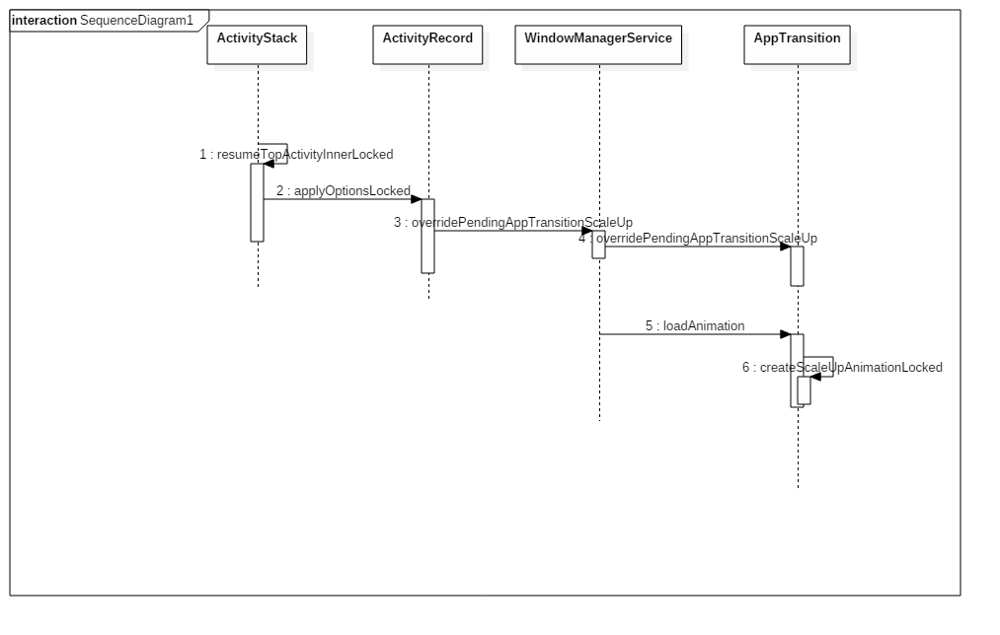
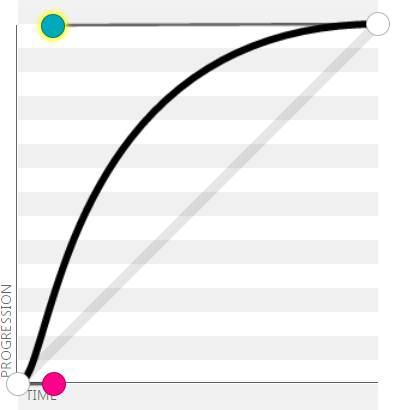

> 3年前开发Rom时的一个任务，就是仿照IOS打开应用和退出应用的开发过程和思路，可能已经过时，现在拿出来看看以前的思路


### 目标

最终效果做到如下的形式: 点击Launcher上的icon，app从Icon的位置开始放大到全屏，观察发现Launcher也有从Icon位置放大的效果;退场时，app界面和Launcher同时缩小到Icon位置

### 设置方法的选择:
进出场动画和转场动画的本质是一样,都是从一个activity过渡到另一个activity的动画,所不同是进出场动画是在两个app之间的过渡，而且Launcher所在的activity是一个壁纸窗口，这是使用的时候需要注意的。
    
#### 三种方法
- 设置theme中的 android:windowAnimationStyle
这是最简单方便的方式，只需要我们配置几个动画的xml就ok了，缺点是由于是在主题的里面的静态资源，不能根据实际情况改变动画类型和和设置相关参数。诸多条件限制决定了这种方式不能达到目的。
- overridePendingTransition方式
这种方式可以让我们覆盖掉第一种方式设置的动画，优点是我们可以在代码里面动态改变它，但遗憾的是这个方法只受动画的xml文件形式，也无法接受设置动画的参数。
- ActivityOptions方式
这种方法是在startActivity的时候，通过ActivityOptions构造出一个Bundle参数，传递给WindowManager，用来覆盖默认的动画，这样就为我们定义转场动画提供了扩展空间。实际查看Launcher的源代码，原生也是这么做的。
<!--more-->

### 准备

进出场动画的设置流程主要与AMS和WMS有关，主要参考以下博客:
[android Application Component研究之Activity(二)](http://blog.csdn.net/windskier/article/details/7172710)
 [WindowManagerService动画分析](http://blog.csdn.net/guoqifa29/article/details/49273065) 

为了更好的分析动画的设置流程，需要打开WMS和AMS的日志开关
通过`adb shell dumpsys window -d enable a`打开WMS的日志开关
通过`adb shell dumpsys activity log a on`打开AMS的日志开关


### 进场动画
首先观察进场动画：点击APP的Icon后，整个界面从Icon位置放大，Icon放大到一定程度后可以隐约看到APP的界面，继续放大，app界面逐渐从透明到不透明，最终覆盖全屏。

Android原生通过ActivityOptions提供了一个类似的转场动画makeScaleUpAnimation，它的使用如下:

```java
ActivityOptions opts = ActivityOptions.makeScaleUpAnimation(v, left, top , width , height);
startActivity(intent, opts.toBundle());
```

其效果出来只有app放大，而Launcher没有动画效果，找遍资料可以发现android没有提供相关接口。
	查看makeScaleUpAnimation方法的源码:
```java
public static ActivityOptions makeScaleUpAnimation(View source,
        int startX, int startY, int width, int height) {
    ActivityOptions opts = new ActivityOptions();
    opts.mPackageName = source.getContext().getPackageName();
    opts.mAnimationType = ANIM_SCALE_UP;
    int[] pts = new int[2];
    source.getLocationOnScreen(pts);
    opts.mStartX = pts[0] + startX;
    opts.mStartY = pts[1] + startY;
    opts.mWidth = width;
    opts.mHeight = height;
    return opts;
}
```
发现里面并没有构造一个`Animation`,只是设置了相关位置的相关参数，以及`ANIM_SCALE_UP`这个动画类型的标识，真正构造动画的方法在`com.android.server.wm.AppTransition`里面，这是一个协助`WindowManagerServervice`来设置转场动画的类。当真正需要执行动画时，会从`AppTransition`中加载或构造合适的动画，交由`WindowManagerServervice`来执行。

`AppTransition`每次会加载两个动画，一个是打开(`enter`)动画，另一个是退出(`exit`)动画，从`Launcher`打开`Activity`，对`Activity`来说是`enter`，对`Launcher`就是`exit`，加载`ScaleUp`的动画都会调用AppTransition的`createScaleUpAnimationLocked`:

```java
private Animation createScaleUpAnimationLocked(int transit, boolean enter,int appWidth, int appHeight) {
    Animation a = null;
    if (enter) {
	    ...
    }else{
	    ...
    }
    return a;
}
```
这个方法有几个参数:
- `transit`: 表示本次过渡动画的类型, 由于`Laucher`是壁纸窗口,所以此时`transit`的值为`TRANSIT_WALLPAPER_CLOSE`
- `enter`:表示该窗口时进入还是退出,后来加载动画的时候调用两次`createScaleUpAnimationLocked`,两次就是这个参数值不同，一次为true，一次为false
- `appWidth`, `appHeight`:顾名思义，为app最终的宽高

`createScaleUpAnimationLocked`可以看到进入`enter=true`时的动画，其实就是两个动画的组合，一个放大动画`ScaleAnimation`，一个透明度变化动画(`AlphaAnimation`)，这就是App打开时的动画，而`enter=false`时，这时加载的应该是App打开时Launcher的动画，却只有透明度变化(`AlphaAnimation`)，仿照app放大的动画写一个launcher放大的动画即可:

先看app放大的动画:
```java
if (enter) {
       // Entering app zooms out from the center of the initial rect.
       float scaleW = mNextAppTransitionStartWidth / (float) appWidth;
       float scaleH = mNextAppTransitionStartHeight / (float) appHeight;
       Animation scale = new ScaleAnimation(scaleW, 1, scaleH, 1,
               computePivot(mNextAppTransitionStartX, scaleW),
               computePivot(mNextAppTransitionStartY, scaleH));
               //modify start
       if(XOS_LANCHER_TRANSITION && transit == TRANSIT_WALLPAPER_CLOSE){
           scale.setInterpolator(mDecelerateXLauncherInterpolator);
       }else{
           scale.setInterpolator(mDecelerateInterpolator);
       }
       //modify  end
        Animation alpha = new AlphaAnimation(0, 1);
       //modify start
       if(XOS_LANCHER_TRANSITION && transit == TRANSIT_WALLPAPER_CLOSE){
           alpha.setInterpolator(mThumbnailXLauncherFadeInInterpolator);
       }else{
           alpha.setInterpolator(mThumbnailFadeOutInterpolator);
       }
       // modify end
       AnimationSet set = new AnimationSet(false);
       set.addAnimation(scale);
       set.addAnimation(alpha);
       set.setDetachWallpaper(true);
       a = set;
}
```
这时我更换了原来的两个动画的`Interpolator`，其中`mDecelerateXLauncherInterpolator = new DecelerateInterpolator(2.5f)`，将放大动画速度的因子调大，以便使减速过程更明显

```
mThumbnailXLauncherFadeInInterpolator = new Interpolator() {
      @Override
      public float getInterpolation(float input) {
      // Linear response for first fraction, then complete after that.
          if (input < RECENTS_THUMBNAIL_XLAUNCHER_FADEOUT_FRACTION) {
              float t = input / RECENTS_THUMBNAIL_XLAUNCHER_FADEOUT_FRACTION;
              return mLinearOutSlowInInterpolator.getInterpolation(t);
          }
          return 1f;
      }
  };
```
`RECENTS_THUMBNAIL_XLAUNCHER_FADEOUT_FRACTION=0.15`，这样以便app界面能够更快的将背景的Launcher界面上的Icon图标完全覆盖，不至于出现Launcher界面放大时看出变得很大的Icon图标

然后是Launcher的放大动画:
```
if(XOS_LANCHER_TRANSITION && transit == TRANSIT_WALLPAPER_CLOSE){
     //enter app : animation for launcher exit
     //mNextAppTransitionStartWidth,mNextAppTransitionStartHeight 是通过StartActivity传入的APP Icon的宽高，appWidth，appHeight是app全屏的时的大小
     float scaleW = mNextAppTransitionStartWidth / (float) appWidth;
     float scaleH = mNextAppTransitionStartHeight / (float) appHeight;
     //因为对Launcher来说是从原来的大小放大，所以最终的大小是scaleW和scaleH的倒数
     float sW = scaleW > 0.001 ? 1 / scaleW : 1000f;
     float sH = scaleH > 0.001 ? 1 / scaleH : 1000f;
     //第三和第四个参数是缩放点的中心位置，计算方法和app放大的位置相同，这样才能保证
     Animation scale = new ScaleAnimation(1f, sW, 1f, sH,
              computePivot(mNextAppTransitionStartX, scaleW),
              computePivot(mNextAppTransitionStartY, scaleH));
      scale.setInterpolator(mDecelerateInterpolator);
      Animation alpha = new AlphaAnimation(1f, 0.0f);
      alpha.setDuration(300);
      alpha.setInterpolator(mThumbnailFadeOutInterpolator);
      AnimationSet set = new AnimationSet(false);
      set.addAnimation(scale);
      set.addAnimation(alpha);
      set.setDetachWallpaper(true);
      a = set;
}
```

经过这几步修改，进场动画基本完成
总结:
- `ActivityOptions.makeScaleUpAnimation`来实现需要的放大动画
- 原来的`App`放大的动画需要调整`Interpolator`，即放大动画和透明度动画的变化速率
- 加载Launcher动画时也需要调用`createScaleUpAnimationLocked`方法，只是传入的enter值为false
- Launcher的动画缩放中心位置和App缩放动画是相同的，但是放大倍数是相反的

### 退场动画

进场动画可以通过`startActivity(intent, opts.toBundle());`传参数到`AppTransition`类中构造对应的方法，而退场时却没有对应的方法，这时候面临几个问题:
 -  怎么设置退场动画
 -  什么时候来设置退场动画
 - 退场动画的位置参数从哪里来

这里看一下进场动画时的设置流程:


可以看到是`ActivityStack`在执行`Resume`的流程时一步步将`ScaleUp`的相关参数设置到AppTranssion中去的。
所以可以仿照这个流程在`WindowMamagerService`和`AppTransition`中添加一个`overridePendingAppTransitionScaleUp`方法:
`WindowMamagerService`中添加:

```java
public void overridePendingAppTransitionScaleDown(int startX, int startY, int startWidth,
            int startHeight) {
        synchronized(mWindowMap) {
            mAppTransition.overridePendingAppTransitionScaleDown(startX, startY, startWidth,startHeight);
        }
    }
```
AppTransition中添加:
```java
void overridePendingAppTransitionScaleDown(int startX, int startY, int startWidth,
                                                    int startHeight) {
    if (isTransitionSet()) {
        mNextAppTransitionType = NEXT_TRANSIT_TYPE_SCALE_DOWN;
        mNextAppTransitionPackage = null;
        mNextAppTransitionThumbnail = null;
        mNextAppTransitionStartX = startX;
        mNextAppTransitionStartY = startY;
        mNextAppTransitionStartWidth = startWidth;
        mNextAppTransitionStartHeight = startHeight;
        postAnimationCallback();
        mNextAppTransitionCallback = null;
    }
}
```
`NEXT_TRANSIT_TYPE_SCALE_DOWN`是我自定义的一个动画，用来表示退场的动画
AppTransition类中添加:

```java
 Animation loadAnimation(WindowManager.LayoutParams lp, int transit, boolean enter,
            int appWidth, int appHeight, int orientation, Rect containingFrame, Rect contentInsets,
            Rect appFrame, boolean isVoiceInteraction) {
         ....
            // add start
        } else if(XOS_LANCHER_TRANSITION && transit == TRANSIT_WALLPAPER_OPEN
                        && mNextAppTransitionType == NEXT_TRANSIT_TYPE_SCALE_DOWN){
            a = createScaleDownAnimationLocked(transit, enter, appWidth, appHeight);if (DEBUG_APP_TRANSITIONS || DEBUG_ANIM) Slog.v(TAG,
                    "applyAnimation:"
                    + " anim=" + a + " nextAppTransition=ANIM_SCALE_DOWN"
                    + " transit=" + appTransitionToString(transit) + " isEntrance=" + enter
                    + " Callers=" + Debug.getCallers(3));
        //add end
        }
        ....
}
...
private Animation createScaleDownAnimationLocked(int transit, boolean enter,int appWidth, int appHeight) {
     ....
}
```
`loadAnimation`用来选择加载哪个动画，而`createScaleDownAnimationLocked`便是真正实现的地方了，也是最重要的地方，需要反复微调效果，放在最后说。

怎么设置怎么设置退场动画解决了，但是什么时候来设置它呢？通过分析log发现，不管进场还是退场的时候其实都会执行一次`AcitivityStack`的`resumeTopActivityInnerLocked`，通过`ActivityRecord.applyOptionsLocked`来试图设置过场动画，只是`AcitivityOption`在用完一次后就置null了，以后无法再次使用，为达到目的，需要将进场时的`AcitivityOption`保存起来。
这里不能将`AcitivityOptions`保存在`ActivityRecord`里面，因为一个`AcitivityRecord`会对应一个`Acitivity`，而我们打开`app`可能会打开多个`Activity`，退出的时候很有可能不是从进来的`Activity`退出的。这时候就需要将`ActivityOptions`保存在`Task`即`TaskRecord`中

所以我思路是这样的:
- 打开app的时候，判断前一个`Activity`是否是`Launcher`，表示是从`launcher`打开app，是的话将`AcitivityOptions`保存到当前app所在的`TaskRecord`
- 退出app的时候，判断后一个`Activity`是否是`Launcher`，表示退出app，是的话将`AcitivityOptions`参数从前一个`TaskRecord`中取出来放入`Launcher`所在`ActivityRecord`，这样`ActivityRecord`就有参数来设置退场动画了

但是在实际操作过程中遇到一个问题，如果将上述的操作放在`resumeTopActivityInnerLocked`中会在很多情况下这个方法是取不到前一个`ActivityRecord`的对象的，但这些操作又要放在`resumeTopActivityInnerLocked`之前。这里思考到在`Acitivity` resume之前，肯定会执行前一个`Activity`的`pause`操作，最后到找一个合适的保存参数的位置即`startPausingLocked`

```java
final boolean startPausingLocked(boolean userLeaving, boolean uiSleeping, boolean resuming,boolean dontWait) {
		...
       //add start
       final TaskRecord prevTask = prev != null ? prev.task : null;
       final TaskRecord nextTask = next != null ? next.task : null;
       if (DEBUG_STATES) Slog.v(TAG_STATES, "Moving to PAUSING: " + prev+";next:"+next+";prevTask:"+prevTask);
       if(XOS_LANCHER_TRANSITION && prev != null && prev.isHomeActivity()){
	       //前一个activity是Launcher是，将ActivityOptions保存到下一个TaskRecord中
        ActivityOptions opt = next != null ? next.pendingOptions : null;
           if(opt != null && opt.getAnimationType() == ActivityOptions.ANIM_SCALE_UP && nextTask != null){
               nextTask.updatePendingOptions(opt);
               if(DEBUG_STATES){
                   Slog.d(TAG_STATES,"resumeTopActivityLocked updatePendingOptions to task:"+opt);
               }
           }
       }
		if(XOS_LANCHER_TRANSITION && ((next != null && next.isHomeActivity())||next == null)){
           boolean maySkip = false;
           if(next == null){
               maySkip = PowerOffAlarmUtility.isAlarmBoot();
           }
           //会存在有些情况获取的下一个AcitivityRecord为null，这些问题nex都是为Launcher的
            ActivityRecord homeRecord = next != null ? next : mStackSupervisor.getHomeActivity();
           if(DEBUG_STATES){
                   Slog.d(TAG_STATES,"resumeTopActivityLocked maySkip:"+maySkip+"; homeRecord:"+homeRecord);
           }
            if(!maySkip && homeRecord != null && prevTask != null && prevTask.mPendingOptions != null){
               homeRecord.updateScaleOptions(prevTask.mPendingOptions);
               if(DEBUG_STATES){
                   Slog.d(TAG_STATES,"resumeTopActivityLocked updatePendingOptions restore from task:"+prevTask.mPendingOptions);
               }
           }
       }
       //add end
       ...
}
```
这样我们都顺利的记住了进入App和退出App时的位置信息

接下来看`AppTransition.createScaleDownAnimationLocked`方法，它是退场动画的构造。与`createScaleUpAnimationLocked`所构造的动画是相反的。不过会有几个问题：

* 退场动画需要一个合适的减速过程才能达到理想的效果

经过反复试验，最终采用以(0.1,0),(0.1,1)为控制点的三阶贝塞尔曲线


* 放慢速度会发现，在退场动画时app界面会在Launcher界面下面，这样会感觉Icon图标变得很巨大，而没有给人App界面缩小，最后变成Icon的错觉

这个需要调试动画时App界面和Launcher界面的Z轴的层次，所以App动画需要设置`set.setZAdjustment(Animation.ZORDER_TOP);`,而Launcher的动画需要设置:`set.setZAdjustment(Animation.ZORDER_NORMAL);`

* 缩放时`Launcher`宽高缩放需要等比，不然会变形，但App的缩放注定又不是等比的，这样会导致App界面消失时由于比`Icon`而残影严重。最后通过单独调节Y轴方向上的缩放速率来减轻残影。

* 最后还有一个关键点，那就是app界面缩小时透明度的变化，它关系到在退场过程中能否给人感觉平滑过渡到Icon图标
下面是调节透明度变化的Interpolator
```
final Interpolator xInterploator = new DecelerateInterpolator(3f);
mThumbnailXLauncherFadeOutInterpolator = new Interpolator() {
     @Override
     public float getInterpolation(float input) {
         // Linear response for first fraction, then complete after that.
         if(input <= 0.10){//动画开始一段时间app界面保持完全透明
             return 0f;
         }
         if (input <= 0.95f) {
             float t = (input - 0.10f)/ 0.85f;
             return xInterploator.getInterpolation(t);//透明度变化经历一个减速过程
         }
         return 1f;
     }
 };
```


最终`createScaleDownAnimationLocked`方法如下:

```java
private Animation createScaleDownAnimationLocked(int transit, boolean enter,
                                               int appWidth, int appHeight) {
    //modify  lancher_transition start
    int startWidth = mNextAppTransitionStartWidth ;
    int startHeight = mNextAppTransitionStartHeight ;
    int startX = mNextAppTransitionStartX ;
    int startY = mNextAppTransitionStartY ;
    if(startWidth == mAppIconSize){//需要对icon的大小进行一定的修正
        int inset = 5 ;
        startWidth = startWidth - inset * 2;
        startHeight = startWidth;
        startX = startX + inset;
        startY = startY + inset;
    }
    //modify end
    Animation a = null;
    if (!enter) {
        // Exit app zooms out from the center of Launcher icon rect.
        //modify lancher_transition start
        float scaleW = startWidth / (float) appWidth;
        float scaleH = startHeight / (float) appHeight;
        Animation scale = new ScaleAnimation(1, scaleW, 1, 1,
                computePivot(startX, scaleW),
                computePivot(startY, scaleH));
        scale.setInterpolator(mFastOutSlowInInterpolator);
        Animation scale2 = new ScaleAnimation(1, 1, 1, scaleH,
                computePivot(startX, scaleW),
                computePivot(startY, scaleH));
        scale2.setInterpolator(mScaleDownYDecelerateInterpolator);
        //modify lancher_transition start

        Animation alpha = new AlphaAnimation(1, 0);
        alpha.setInterpolator(mThumbnailXLauncherFadeOutInterpolator);
        AnimationSet set = new AnimationSet(false);
        set.addAnimation(scale);
        set.addAnimation(scale2);
        set.addAnimation(alpha);
        set.setDetachWallpaper(true);
        set.setZAdjustment(Animation.ZORDER_TOP);
        a = set;
    }else{
	    float scaleW = startWidth / (float) appWidth;
        float scaleH = startHeight / (float) appHeight;
        float sW = scaleW > 0.001 ? 1 / scaleW : 1000f;
        float sH = scaleH > 0.001 ? 1 / scaleH : 1000f;
        if(startWidth == startHeight){
            sW = Math.min(sW,sH);
            sH = sW;//保存Laucher是等比缩放
        }
	    Animation scale = new ScaleAnimation(sW, 1f, sH, 1f,
                   computePivot(startX, scaleW),
                   computePivot(startY, scaleH));
         scale.setInterpolator(mFastOutSlowInInterpolator);

         Animation alpha = new AlphaAnimation(0.0f, 1f);
         alpha.setInterpolator(mThumbnailFadeOutInterpolator);
         AnimationSet set = new AnimationSet(false);
	     set.addAnimation(scale);
          set.addAnimation(alpha);
          set.setDetachWallpaper(true);
          set.setZAdjustment(Animation.ZORDER_NORMAL);
          //modify lancher_transition end
          a = set;
     }
     long duration = 380L;
    //modify lancher_transition start
    a.setDuration(duration);
    a.setFillAfter(true);
    a.setInterpolator(mDecelerateInterpolator);
    a.initialize(appWidth, appHeight, appWidth, appHeight);
    return a;
 }
```

### 不足之处

主要表现在退场时不够完美
- 退场时app界面的残影仍然存在，在Icon图标不为方形时明显
- 由于只app退出时只能回到进场时点击的位置，所以当Launcher上的app图标改变了，然后从任务列表进入app界面，再退出是无法缩放到正确的位置的。