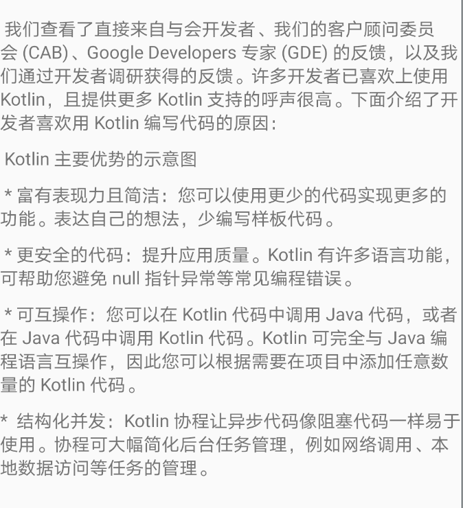

### 设置行间距

TextView设置行高我们可以使用android:lineSpacingExtra`或`android:lineSpacingMultiplier` 

1. android:lineSpacingExtra 设置行间距，如”10dp”。

   表示额外的行间距数值，单位通常为dp，值可以为负数，小数和0。如果值为正数表示增加行间距；如果值为负数表示减少行间距；如果值为0，则没有    变化。

在java代码中

2. android:lineSpacingMultiplier 设置行间距的倍数，如”1.5或者2″

   表示行间距的倍数，没有单位，值可以为任意浮点数。如果值大于1.0表示增加行间距，如果值小于1.0表示减少行间距。

3. android:lineSpacingExtra和android:lineSpacingMultiplier 

   可以在一起对同一个TextView进行设置，同时使用时会先增加android:lineSpacingMultiplier设置的倍数，再加上android:lineSpacingExtra设置的额外间距


### 设置段落间距

TextView没有提供段落即有\n换行间距的属性，但是提供了LineHeightSpan可供我们自定义，

```kotlin
/**
 * @author tory
 * 设置段落高度
 */
class ParagraphSpacingSpan(@param:Px private val spacing: Int) : LineHeightSpan {
    override fun chooseHeight(
        text: CharSequence, start: Int, end: Int, spanstartv: Int,
        v: Int, fm: Paint.FontMetricsInt
    ) {
      	//这里的text所有文字，start和end会返回每行文字的区间
        if (isParagraphEnd(text, end)) {
            // let's just add what we want
            fm.descent += spacing
            fm.bottom += spacing
        }
    }

    private fun isParagraphEnd(text: CharSequence, end: Int): Boolean {
        return text.getOrNull(end - 1) == '\n'
    }

    companion object {

        fun getSpacingSpannable(text: String, spacing: Int): CharSequence {
            return if (text.contains('\n')) {
                val spannable = SpannableString(text)
                spannable.setSpan(ParagraphSpacingSpan(spacing),
                    0, text.length, Spannable.SPAN_INCLUSIVE_EXCLUSIVE)
                return spannable
            } else text
        }
    }
}

```

<!--more-->

例如:

```kotlin
//这里使用"""实际上自带换行
val textParagraph = """
            我们查看了直接来自与会开发者、我们的客户顾问委员会 (CAB)、Google Developers 专家 (GDE) 的反馈，以及我们通过开发者调研获得的反馈。许多开发者已喜欢上使用 Kotlin，且提供更多 Kotlin 支持的呼声很高。下面介绍了开发者喜欢用 Kotlin 编写代码的原因：
            Kotlin 主要优势的示意图
            * 富有表现力且简洁：您可以使用更少的代码实现更多的功能。表达自己的想法，少编写样板代码。
            * 更安全的代码：提升应用质量。Kotlin 有许多语言功能，可帮助您避免 null 指针异常等常见编程错误。
            * 可互操作：您可以在 Kotlin 代码中调用 Java 代码，或者在 Java 代码中调用 Kotlin 代码。Kotlin 可完全与 Java 编程语言互操作，因此您可以根据需要在项目中添加任意数量的 Kotlin 代码。
           *  结构化并发：Kotlin 协程让异步代码像阻塞代码一样易于使用。协程可大幅简化后台任务管理，例如网络调用、本地数据访问等任务的管理。
        """.trimIndent()
val text = ParagraphSpacingSpan.getSpacingSpannable(textParagraph, dpToPx(10))
textView.text = text
```

效果

